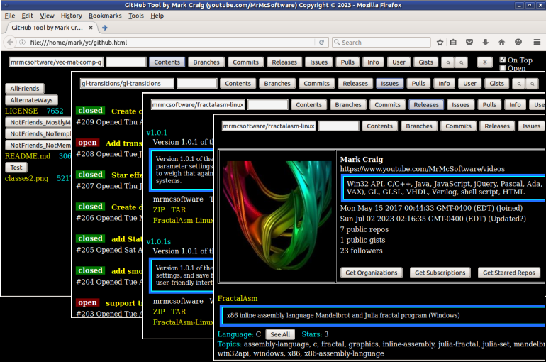
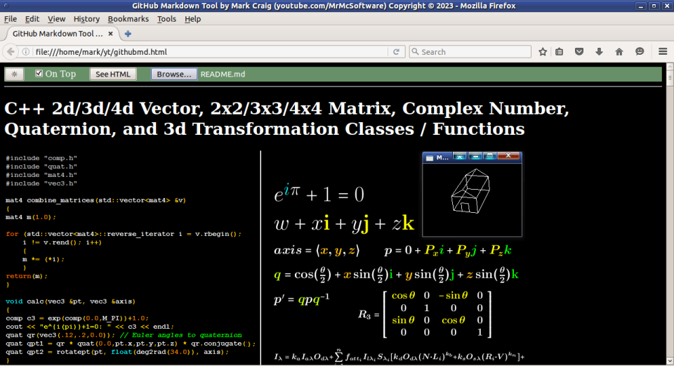
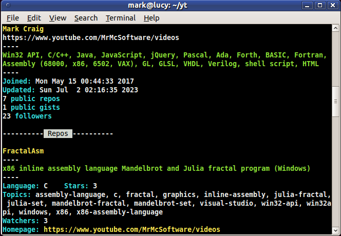

Github Tool
===========

This is an HTML file for accessing Github.com repositories and users via
Github's web API.

<table border=5><tr><td></td></tr></table>

(I purposely used an older browser for the screenshots because I prefer the 3d
look over the flat button look of some modern browsers.)

You might wonder why use this tool, why not just use github.com?  Well, for one
thing, github.com is often being changed.  If you don't like the changes or the
changes won't work in your browser, using github.com might not be preferred.
Also, I feel this tool is a good example of not only using github.com's web API
but also programming API access in general.  I provide many different ways of
doing things, so you can learn the different ways, and use what you like the
most.  And finally, at some point in the future (or even now), you may need to
automate your github.com accesses.  This tool's code can show you how you could
do that.  Not to mention, there's something kinda "meta", as they say, about
creating a github repository whose purpose is to access github repositories.

Be sure to check out the bonus tools mentioned below ([Bonus Tool](#bonustool)
and [Another Bonus Tool](#bonustool2))

## Setup and Running

>**OPTIONAL:**  If you want a gradual transition between Dark and Light modes,
>uncomment the line containing **transition: color 300ms, background-color 300ms;**

There are various ways of starting up this webpage.  If your browser is in your
search path you could simply do the following, for example, at a command prompt:

    firefox github.html

Or you could start your browser and use your browser's "Open File" (or
equivalent) menu option.  Or you could use the **`file:///`** URI/protocol and
specify the whole path.

For a live demo, go to **https://mrmcsoftware.github.io/GithubTool** but do
try to use your own copy instead.

>Note: Ignore **`index.html`** and **`jquery.min.js`** .  They are only there
>to make Github Pages work.

## User Interface

All input boxes, buttons, and links have tool tips to explain how to use that
element.  Hover your mouse over the element to see the tool tip.

Since I didn't like the look of a bunch of underlined text links, I turned off
the underline decorations.  Admittedly, this makes it harder to know if the
text is a link.  However, if you hover over it, an underline will appear (as
well as a tool tip).  In the section after the next one, I explain all the text
links.

Many listings will paginate if there are more than 100 results - at the end of
the page you will see as many as four buttons for **First**, **Prev**, **Next**,
and **Last**.  The number listed on the button is the page number you would go
to if you clicked it.

### URL Parameters

These are optional parameters you can use if you don't like the defaults.
Use these like this, for example (If specifying this on a terminal commandline,
you probably will need to escape the special characters, depending on your OS
(for example: **`github.html?dark=false\&dirbut=false`** if using Linux,
**`"github.html?dark=false&dirbut=false"`** if using Windows)):

    github.html?dark=false&dirbut=false&expandinput=true&contents=mrmcsoftware/Vec-Mat-Comp-Quat

  - **dark=false** - Turn off dark mode
  - **dform=false** - Use HTML `<pre>` tag to show descriptions
  - **dirbut=false** - Don't use buttons for directories (Contents), use text links instead
  - **keepontop=false** - Don't always keep the control bar at top of screen
  - **openonly=true** - When listing repository issues or pulls, don't show closed items
  - **expandinput=true** - Expand the text input fields for wider screens
  - **contents=`{string}`** - Display the contents of the specified ({string}) repository
  - **repo=`{string}`** - Display the contents of the specified ({string}) repository (same as **contents='{string}'**)
  - **ref=`{string}`** - Specify repository's branch, commit, or tag name if desired
  - **branches=`{string}`** - Display the branches of the specified ({string}) repository
  - **commits=`{string}`** - Display the commits of the specified ({string}) repository
  - **releases=`{string}`** - Display the releases of the specified ({string}) repository
  - **issues=`{string}`** - Display the issues of the specified ({string}) repository
  - **pulls=`{string}`** - Display the pull requests of the specified ({string}) repository
  - **info=`{string}`** - Display information about the specified ({string}) repository
  - **user=`{string}`** - Display information about the specified ({string}) user
  - **searchrepos=`{string}`** - Search repositories for the specified ({string}) term
  - **searchusers=`{string}`** - Search users for the specified ({string}) term

### Text Boxes, Buttons, Checkboxes, and Links

  - To access a repository or user, type it into the top-left text input box.
Repositories should be in for form of {username}/{reponame}.  For example:
"**`mrmcsoftware/vec-mat-comp-quat`**".  However, "https://github.com/" can be
prefixed (for example: "https://github.com/mrmcsoftware/vec-mat-comp-quat" is
fine).
You can either press "**Enter**" on keyboard after you type the string or click
the appropriate button (such as **Contents**).  If you press **Enter**, the
repository's contents will be shown.

  - The second text input box is used to optionally specify the repository's
branch, commit, or tag name if desired in order to access a particular point in
the repository's timeline.

  - Click the **Contents** button to view a listing of the repository's contents.
Press **Shift** key while clicking to open a new tab to the github.com page for
the repository.  Or press **Ctrl** key while clicking to process the
repository's README.md file for markdown and open it in a new tab.  Assuming
no key was pressed while clicking, you'll see a listing of the repo's contents.
Directories/Folders will be shown as buttons unless **dirbut=false** was
specified in the URL (in which case, the directories will be text links with
a different color).  Click on the directory entry to go to that directory.  Once
in a directory, click **..** to get back to the parent directory.  Click on any
particular file to open a tab containing that file (through URL to
**raw.githubusercontent.com**).  By the way, the number after each file is the
file size.  Click on the size to get the file (through the github.com API).
Press **Ctrl** while clicking to display file in a new tab while interpreting
HTML tags (if there are any in the file).  No pressed keys will do the same but
without interpreting HTML tags.  Press **Shift** while clicking to download
the file.  If your browser is set up this way, you'll get a prompt to either
Save it or Open it with a selectable program.  This can be useful if, for
example, you want to view the file with a syntax highlighting viewer or editor,
such as gvim, neovim, Notepad++, etc.

  - Click the **Branches** button to view all the branches of the repo.  You can
click the **ZIP** link to download a zip file of that branches contents.  The
listings of branches will paginate if more than 100 results.

  - Click the **Commits** button to view all the commits of the repo.  The
listings of commits will paginate if more than 100 results.

  - Click the **Releases** button to view all the releases (if any) of the repo.
Click on **ZIP**, **TAR**, or a filename with **.tar.gz** to download the
release assets.  The listings of releases will paginate if more than 100 results.

  - Click the **Issues** button to view all the issues (if any) of the repo.  Click
on the issue title to see the description of the issue.  Click the issue number
to open github.com's issue page for that issue in a new tab.  The **Pulls**
button works similarly.  By the way, if the **Open** checkbox is checked, only
open issues or pulls will be shown (as opposed to both open and closed).
The listings of issues and pulls will paginate if more than 100 results.

  - Click the **Info** button to view some information and analytics for the repo.
Click on the **Stars** number to get a listing of users who starred the repo.
Click on the **Forks** number to get a listing of users who forked the repo.
Click on the **Subscribers/Watchers** number to get a listing of users who
subscribe (or watch) the repo.  Github mixes up the meaning of Watchers, so
the number of watchers may not be the same as the number of
subscribers/watchers.  Click **Get Contributors** to get a listing of the
contributers to the repo.  By the way, in my tool, these listings of users will
at most be 100 since I didn't implement pagination and the API returns a
maximum of 100 per page.

  - Click the **User** button to view information about the user (including the
user's repositories).  For this, in the top-left text input box, you can either
specify only the username or both the username and repository name (as you
would for the Contents button, etc.).  You can also specify the user id number
preceded by an **`@`** symbol.  In the user information box, you can
click on the Followers data to get a list of followers,  Similarly, you can
click on the Followings data (if present) to get a list of users the user
follows.  Click the **Get Organizations** button to get a list of organizations
the user is a member of, **Get Subscriptions** button to get a list of repos
the user subscribes to, and **Get Starred Repos** button to get a list of
repos the user has starred.  As with the clickable parts of the **Info**
view mentioned above, theses listings in my tool are also limited to 100.

    After the user information box is the user's repositories (containing any
repos that they created and any repos they forked).  Any repo they forked will
have **(Fork)** after the repo name.  Click on that tag to see the original
repo.  In the Language line for each repo, click **See All** to see all the
computer languages used in the repo (and percentage of each).  Click on the
Stars and Watchers numbers to get a listing of users who starred or watch the
repo (again, watchers and subscribers are used somewhat interchangeably, so
the listing might contain a different number of users that what's reported).
Also note that Github's API documentation doesn't explain what their **update**
date means (is it a push?, etc.).

    Clicking on a repository name will put that repository's designation in
the search box, so that information on that repository can more easily be viewed
(via **Contents**, etc.).

    If only a list of the user's repositories that they themselves created
(rather than forked) is desired, press the **Shift** key while clicking the
**User** button.  Reset this feature back by clicking on the **User** button
without pressing **Shift**.

    The repo listing will paginate if more than 100 repos.

  - Click the **Gists** button to get a listing of the specified user's gists.
The listing follows the same interactions as the **Contents** button except
there shouldn't be any directories.  The listing of gists will paginate if more
than 100 results.

  - Click the first **Search** button (the magnifying glass icon) to search
repositories for the string specified in the top-left input box.  These results
will paginate if more than 100 results.

  - Click the second **Search** button to search users for the specified string.
These results also paginate.

  - Click the **Darkmode/Lightmode Toggle** button (Sun or Moon icon) to
switch between dark mode and light mode.

  - Click the **On Top** checkbox to toggle always keeping the control bar on
the top of the screen.

  - Click the **Open** checkbox to toggle showing only open issues/pulls or
both open and closed.

## Limitations

This github tool doesn't access all of github.com's public information.  I
purposely didn't put in support for information that I felt wouldn't be needed
by most people.  And there is some information that can't be accessed without
being logged in (authenticated), and in some cases can't be accessed without
having "**push**" access to the repository (for example, not being the owner of
the repository).  Authentication could be added to this tool, but I didn't feel
like implementing it (I've done it for other APIs, but didn't have a need to
do it for github.com).

Also, keep in mind there are rate limits on your usage of github.com's API.
Under normal usage, you probably wouldn't hit the limits, but searches do have
lower limits.  If you hit a limit, wait a little bit before trying again.

## Alternate Versions

In case you don't like the reliance on **jQuery**, I've made two versions that
don't use jQuery.  The biggest part was to replace **getJSON** with the
equivalent **AJAX** (XMLHttpRequest) code or the fetch function.
**`github-no-jquery.html`** uses fetch instead of .getJSON and
**`github-no-jquery-no-fetch.html`** uses XMLHttpRequest instead of .getJSON
or fetch (some browsers don't have fetch).

>**NOTE:**  The no-jQuery versions seem to be slower at getting stuff from
>github.com than the jQuery version.

## Bonus Tool

Do you create markdown README.md files, but wish there was a way to know how
Github.com will display them (without having to upload them to a repository
first)?  Use **`githubmd.html`**, **`githubmd-no-jquery.html`**, or
**`githubmd-no-jquery-no-fetch.html`**.  Use the file selector to upload your
file to github's api to have github.com convert your markdown to HTML.  Note:
if there are images in your markdown file, you might need those images to be
in the same directory as **githubmd.html** in order for the images to be seen
by your browser.  Also note, there might be some things that won't look exactly
the same because github.com likely defines certain behaviors in it's CSS style
files (the generated HTML will be essentially the same, but without the style
definitions).  I've tried to approximate the look to some extent, though.

## Another Bonus Tool

I've included a C program I wrote which gets the specified user's information,
a list of the user's repositories, and a list of the user's gists.  It's written
for Linux, but with some effort, it could be rewritten to work in Windows.  To
compile, you'll need both OpenSSL and the Jansson JSON API library
(https://github.com/akheron/jansson) installed.  Compile with:

    cc -o github github.c -lssl -ljansson

Type **`github -h`** for information on the options.  An example run would be:

    github mrmcsoftware

>Note: You can also get the user's information, repositories, etc. by specifying
>the user's ID number preceded by an **`@`** symbol instead of the username.

## Possible Improvements

You might notice that my javascript code isn't always consistent in how it does
certain things.  This is partly because I believe in reusing code I've already
written and partly because I wanted to show that there are many different ways
of doing the same thing.  Much of github is meant for teaching/learning after
all.  My only requirement is that the different ways must not require the most
up-to-date browsers.  But you might want consistency, so feel free to make it
consistent.

**`github.html`** currently gets **jquery.min.js** from Google (ajax.googleapis.com).
You may want to change that to wherever you choose to get jQuery from (or you
may want to change which version of jQuery is used).  You can even download
jquery.min.js to the same directory as github.html and avoid getting it
from the internet every time.  Or use **`github-no-jquery.html`** or
**`github-no-jquery-no-fetch.html`** to avoid jQuery altogether.

As stated above, authentication could be added in order to access some aspects
of Github.com's API.  As is, this tool is for viewing, NOT changing, updating,
deleting, or creating github.com content.  To do the CUD part of CRUD,
authentication would need to be implemented.

## Author

Mark Craig
[https://www.youtube.com/MrMcSoftware](https://www.youtube.com/MrMcSoftware)
